# 学院期刊借阅管理系统 API 接口文档（V1.1）

适用范围：系统前后端联调、测试验证、运维排查

基础路径：[clickme](http://localhost:8080/api)   **!!!后续的接口都加上这个前缀!!!**

维护人：伍怀进

最后更新：12.23 **说明：教师的主键取消自增，请将数据库修改与下方一致**

技术说明：数据格式：JSON；请求方式：GET/POST/PUT/DELETE；认证方式：Session（后续添加） 

## 通用规则：

1.**响应格式规范：**

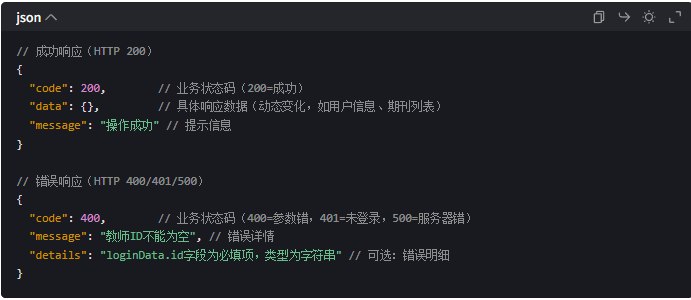

2.**状态码对照表**

| 业务状态码 | HTTP 状态码 | 说明 | 适用场景 |

|------------|------------|---------------------------------------|-----------------------------------|

| 200 | 200 | 操作成功 | 登录成功、借阅成功、查询成功 |

| 400 | 400 | 参数错误 | 未填教师 ID、期刊名称过长 |

| 401 | 401 | 未登录 / 登录失效 | 未登录访问管理员页面、Token 过期 |

| 403 | 403 | 权限不足 | 教师尝试删除期刊、非管理员添加用户 |

| 404 | 404 | 资源不存在 | 查询不存在的期刊 ID、接口路径错误 |

| 500 | 500 | 服务器内部错误 | 数据库连接失败、业务逻辑异常 |

3.**数据库规范：**(请在sqlyog或idea做好相应调整,自行搜索了解主键等概念)

- 管理员表：主键为admin_id,自动递增，从哪里开始递增请自行搜索设定，不会影响功能
  注意下方的默认值（**后面跟上了=**），有默认值的地方在插入时是不用管的

- 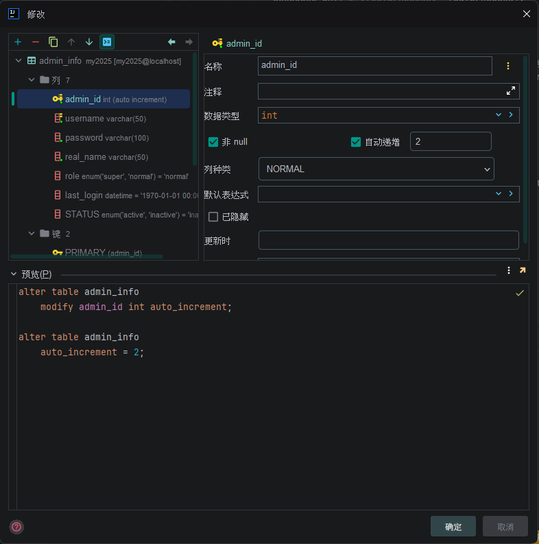 
  
  
  
  
  
  

- 借阅表：主键为borrow_id，无自增栏目，注意外键：journal_id等于期刊表的id，borrower_id对应于教师id，请自行搜索修改
  注意status默认值为returned
  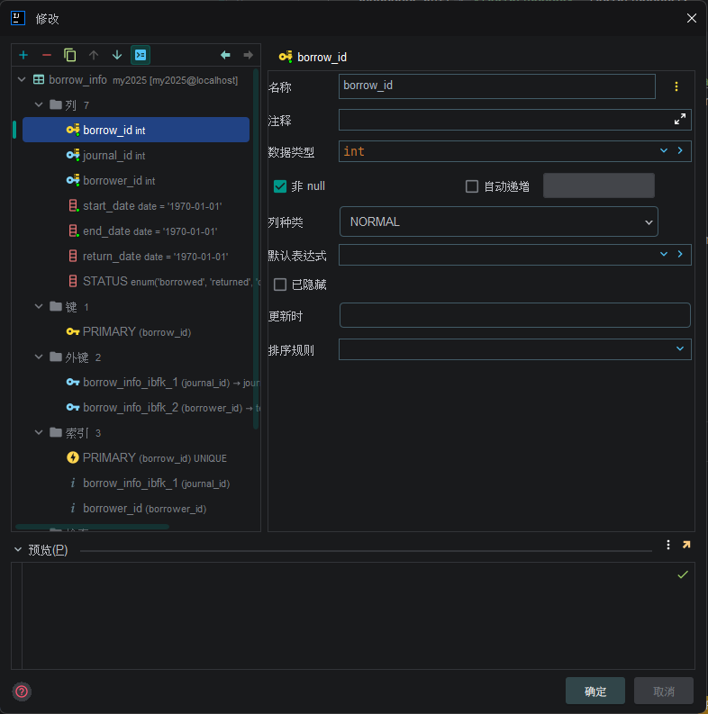
  
  
  
  

- 期刊表：主键id，无自增栏目,下方status默认为available
  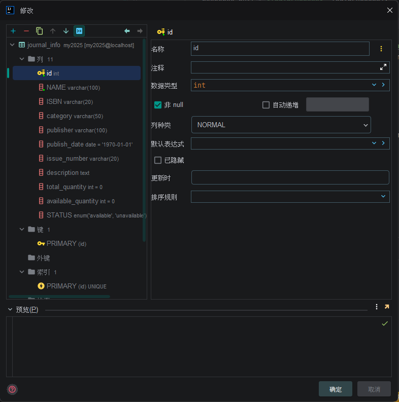
  
  

- 教师表：主键为teacher_id不自增，从1000开始 status默认inactive(同管理员)
  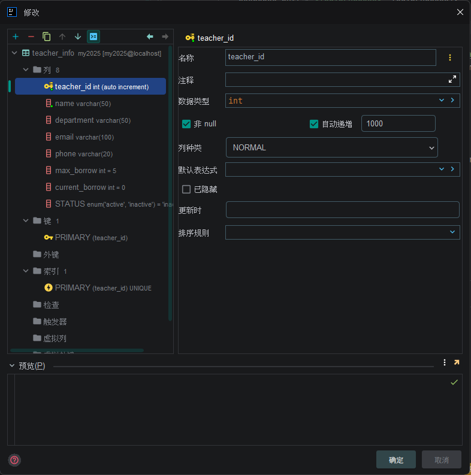
  
  
  
  
  
  

## 接口详情(前端注意有选择性的渲染数据，用于判断展示之类，比如data.valid判断是否合法）

### 模块1：用户认证（教师/管理员登陆注册)

#### 1.1 教师登录接口

- 描述：教师通过ID，姓名，手机号验证身份

- 路径：/auth/teacher/login

- 方法：POST

- 请求体：*相关验证功能可放在前端*
  
  | 字段名   | 类型     | 是否必填 | 说明    | 约束条件                   |
  | ----- | ------ | ---- | ----- | ---------------------- |
  | id    | String | 是    | 教师 ID | 初始递增：1000开始，详情看上方数据表规范 |
  | name  | String | 是    | 教师姓名  | 如 “张三”，不包含特殊字符         |
  | phone | String | 是    | 手机号   | 11 位数字，如 “13800138000” |

- **响应示例（成功）:**(data只返回前三项)
  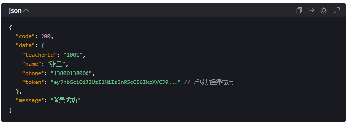

- **响应示例（失败）**：(实际不返回details)
  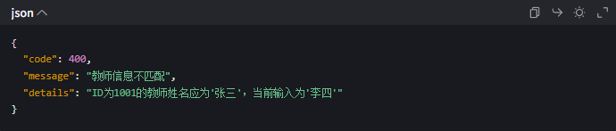
  
  

#### 1.2教师注册接口

- **描述**：教师提交个人信息完成注册（`maxBorrow`/`currentBorrow`/`status`为默认值，无需传入）
* **路径**：`/auth/teacher/register`

* **方法**：POST

* **请求体**（对应`TeacherInfo`实体，排除`insertable=false`字段）：
  
  | 字段名        | 类型     | 是否必填 | 说明   | 约束条件                   |
  | ---------- | ------ | ---- | ---- | ---------------------- |
  | name       | String | 是    | 教师姓名 | 不包含特殊字符，长度 1-50        |
  | department | String | 是    | 所属部门 | 如 “计算机学院”，长度 1-50      |
  | email      | String | 是    | 邮箱   | 符合邮箱格式，长度 1-100        |
  | phone      | String | 是    | 手机号  | 11 位数字，如 “13800138000” |

* **响应示例（成功）**:（data实际只返回前五项）
  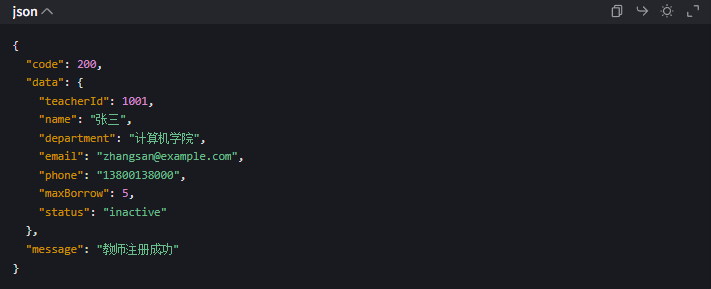
  
  
  
  
  
  

#### 1.3 管理员注册接口（!仅超级管理员可用前端不管!）

* **描述**：添加新管理员（对应你的`AdminController`的`addAdmin`接口）

* **路径**：`/auth/admin/add/username/{username}/password/{password}/realname/{real_name}`

* **方法**：GET

* **请求体**（对应你的`AdminInfo`实体类）：
  
  | 字段名      | 类型     | 是否必填 | 说明    | 约束条件              |
  | -------- | ------ | ---- | ----- | ----------------- |
  | username | String | 是    | 管理员账号 | 如 “admin01”，唯一不重复 |
  | password | String | 是    | 管理员密码 | **哈希密码存储**        |
  | realName | String | 是    | 真实姓名  | 如 “李管理员”          |
  
  

* **响应示例**：
  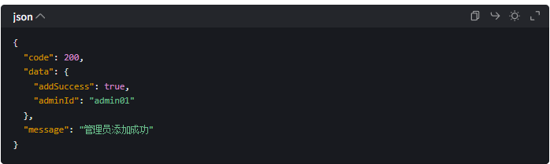
  
  
  
  
  
  

#### 1.4管理员登录接口

- **描述**：管理员通过账号密码验证身份

- **路径**：`/auth/admin/login`

- **方法**：POST

- **请求体**（对应`AdminInfo`实体）：
  
  | 字段名      | 类型     | 是否必填 | 说明    | 约束条件                |
  | -------- | ------ | ---- | ----- | ------------------- |
  | username | String | 是    | 管理员账号 | 如 “admin01”，长度 1-50 |
  | password | String | 是    | 管理员密码 | 8-16 位，含数字 + 字母     |

- **响应示例（成功）**：（实际无token）
  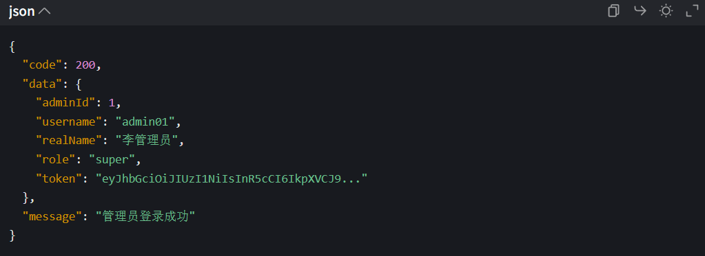
  
  
  
  
  

#### 1.5退出登录接口

* **描述**：通用退出登录接口，更新系统在线人数。
* **请求路径**：`/auth/logout`
* **方法**:POST
* **请求参数**：无
* **响应示例：（成功）**
  
  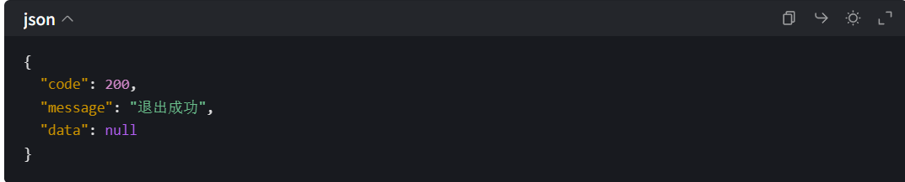

### 模块 2：期刊管理（管理员核心功能)

#### 2.1 查询期刊接口

* **描述**：管理员查询单本期刊的详细信息

* **路径**：`/journal/{id}`

* **方法**：GET

* **路径参数**：
  
  | 参数名 | 类型      | 说明        |
  | --- | ------- | --------- |
  | id  | Integer | 期刊 ID（必填） |

* **响应示例（成功）**：
  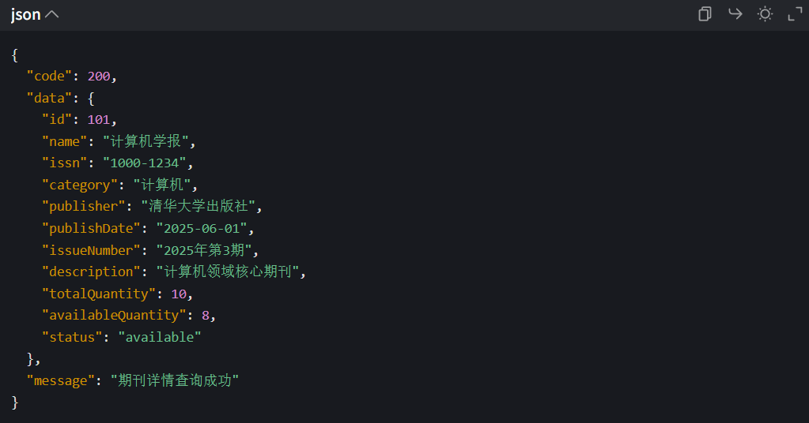
  
  

#### 2.2修改期刊接口

* **描述**：管理员修改期刊信息（支持修改描述、数量、状态等）

* **路径**：`/journal/update`

* **方法**：PUT

* **请求体**（对应`JournalInfo`实体,`id`为必填标识）：
  
  | 字段名               | 类型        | 是否必填 | 说明     | 约束条件                        |
  | ----------------- | --------- | ---- | ------ | --------------------------- |
  | id                | Integer   | 是    | 期刊 ID  | 已存在的期刊 ID                   |
  | name              | String    | 否    | 期刊名称   | 长度 1-100                    |
  | issn              | String    | 否    | ISSN 号 | 长度 1-20                     |
  | category          | String    | 否    | 期刊类别   | 如 “计算机”“数学”                 |
  | publisher         | String    | 否    | 出版社    | 长度 1-100                    |
  | publishDate       | LocalDate | 否    | 出版日期   | ISO 格式：“2025-06-01”         |
  | issueNumber       | String    | 否    | 期号     | 长度 1-20                     |
  | description       | String    | 否    | 期刊描述   | 长文本                         |
  | totalQuantity     | Integer   | 否    | 总数量    | 大于等于 availableQuantity      |
  | availableQuantity | Integer   | 否    | 可借数量   | 大于等于 0                      |
  | status            | String    | 否    | 状态     | 枚举：“available”“unavailable” |
- 响应示例（成功）：
  
  
  

#### 2.3删除期刊接口

* **描述**：管理员删除指定期刊（仅当期刊无未归还借阅记录时可删除）

* **路径**：`/journal/delete/{id}`

* **方法**：DELETE

* **路径参数**：
  
  | 参数名 | 类型      | 说明        |
  | --- | ------- | --------- |
  | id  | Integer | 期刊 ID（必填) |

* **响应示例（成功）**：
  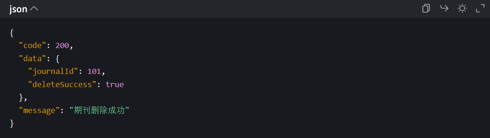

* **响应示例（失败）**
  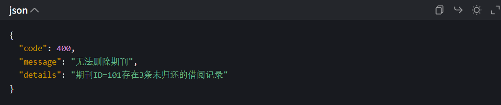
  
  

#### 2.4新增期刊接口

* **描述**：管理员录入新期刊信息（`availableQuantity`默认等于`totalQuantity`，`status`默认`available`）

* **路径**：`/journal/add`

* **方法**：POST

* **请求体**（对应`JournalInfo`实体，排除自增 ID / 默认值字段）：
  
  | 字段名           | 类型        | 是否必填 | 说明     | 约束条件                                       |
  | ------------- | --------- | ---- | ------ | ------------------------------------------ |
  | name          | String    | 是    | 期刊名称   | 长度 1-100，不重复                               |
  | issn          | String    | 是    | ISSN 号 | 长度 8-20，符合 ISSN 格式                         |
  | category      | String    | 是    | 期刊类别   | 枚举：“计算机”“数学”“文学” 等                         |
  | publisher     | String    | 是    | 出版社    | 长度 1-100                                   |
  | publishDate   | LocalDate | 是    | 出版日期   | ISO 格式：“2025-06-01”                        |
  | issueNumber   | String    | 是    | 期号     | 如 “2025 年第 3 期”，长度 1-20                    |
  | description   | String    | 否    | 期刊描述   | 长文本，默认空字符串                                 |
  | totalQuantity | Integer   | 是    | 总数量    | 大于 0，如 5/10/20                             |
  | status        | String    | 否    | 状态     | 枚举：“available”/“unavailable”，默认`available` |

* 响应示例（成功）:
  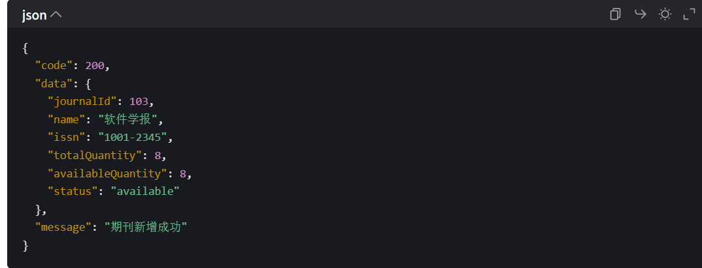

* 响应示例（失败）:
  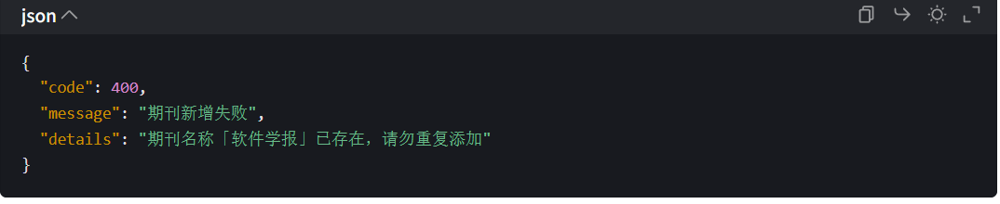
  
  
  
  
  
  
  
  
  
  

### 模块3：借阅管理模块

#### 3.1教师查询个人借阅记录接口

* **描述**：教师查询自己的所有借阅记录（含期刊信息、借阅状态）

* **路径**：`/borrow/teacher/list`

* **方法**：GET

* **请求参数**（URL 参数）：
  
  | 参数名       | 类型      | 是否必填 | 说明                                    |
  | --------- | ------- | ---- | ------------------------------------- |
  | teacherId | Integer | 是    | 教师 ID（登录后从 Session 获取）                |
  | status    | String  | 否    | 筛选状态（如 “borrowed”“returned”“overdue”） |

* **响应示例（成功）**：
  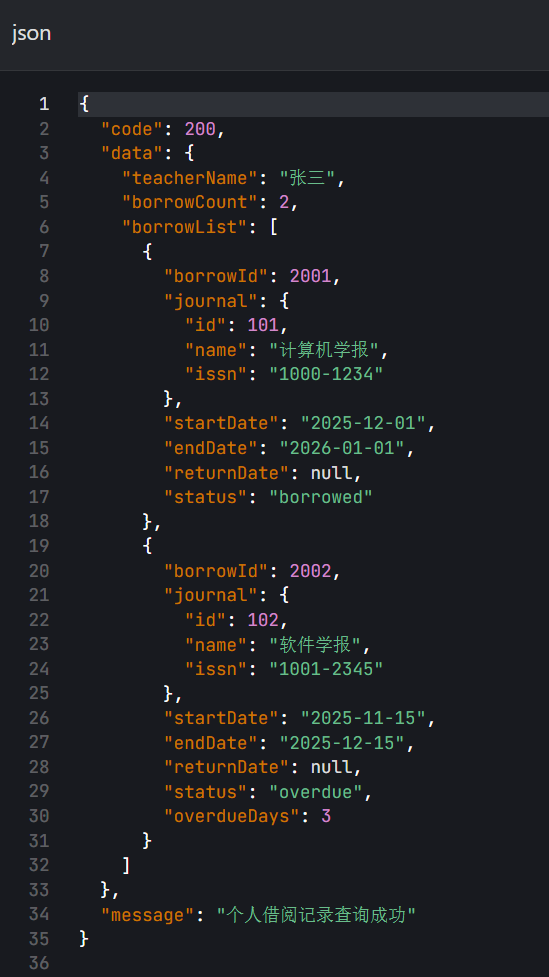
  
  
  
  

#### 3.2教师归还期刊接口

* **描述**：教师归还期刊，更新借阅记录的归还日期和状态

* **路径**：`/borrow/return`

* **方法**：PUT

* **请求体**：
  
  | 字段名       | 类型      | 是否必填 | 说明            |
  | --------- | ------- | ---- | ------------- |
  | borrowId  | Integer | 是    | 借阅记录 ID       |
  | teacherId | Integer | 是    | 教师 ID（验证借阅归属） |

* **响应示例（成功）**：
  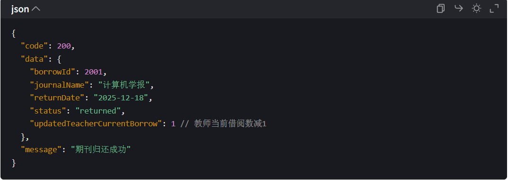
  
  
  
  
  
  

#### 3.3教师借阅接口

* **描述**：教师申请借阅期刊（需验证教师最大借阅数、期刊可借数量）

* **路径**：`/borrow/teacher/create`

* **方法**：POST

* **请求体**（结合`BorrowInfo`+`TeacherInfo`+`JournalInfo`关联字段）：
  
  | 字段名        | 类型      | 是否必填 | 说明    | 约束条件           |
  | ---------- | ------- | ---- | ----- | -------------- |
  | teacherId  | Integer | 是    | 教师 ID | 已注册的教师 ID      |
  | journalId  | Integer | 是    | 期刊 ID | 已存在的期刊 ID      |
  | borrowDays | Integer | 否    | 借阅天数  | 1-30 天，默认 30 天 |

* 响应示例（成功）
  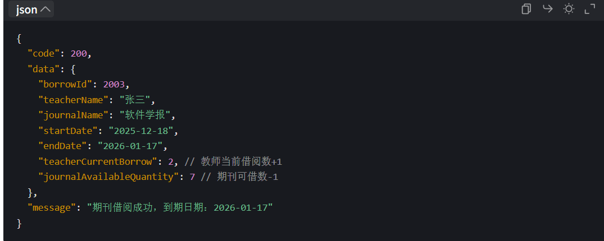

* 响应示例（失败，超过最大借阅数）
  
  

  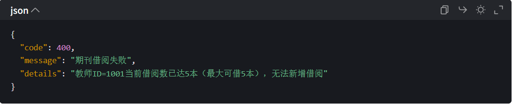

## 文档维护历史

| 版本   | 更新时间       | 更新内容                      | 维护人 |
| ---- | ---------- | ------------------------- | --- |
| V1.0 | 2025-12-18 | 初始版本，包含用户认证、期刊管理、借阅管理核心接口 | 伍怀进 |
| V1.1 | 2025-12-23 | 补充规范化了后端响应体，使其与api文档符合    | 伍怀进 |

